# List of Variables and Fields Used by the MetGIS Point API

## Altitude\_[m]

Altitude of point the forecast was calculated for in meters above mean sea level.

## Description

Short description of the package version.

## FeltTemperature

Parameter that describes the air temperature as felt by a human being. For cold temperatures this is equivalent to wind chill temperatures while for warm temperatures the influence of humidity on the felt temperature is incorporated.

## Forecast_Calculated_LocalTime

Time when the forecast was calculated, related to the local time zone of the point of interest (ISO 8601 date format).

## Forecast_Calculated_UTC

Time when the forecast was calculated in UTC (ISO 8601 date format).

## ForecastTimes_LocalTime

Array of times and dates at which the forecasts in the same object are valid. The time zone is set according to the coordinates of the location and the format is compliant with ISO 8601.

## DewPointTemperature

Dew point temperature at the point of interest for a given time, 2 meters above ground.

## DownwardShortWaveRadiation

Downward short-wave radiation at the point of interest for a given time interval.

## FreshSnowDensity

Forecast of the density the fresh snow will have at the point of interest.

## Icon

File name of weather icon that describes the weather conditions at the point of interest for a given time. The file names are descriptive so it’s easy to use your individual icons. Possible values are described here:

MetGIS Point API icons

| Icon                                   | Description                                        | Image                                                                                    |
| -------------------------------------- | -------------------------------------------------- | ---------------------------------------------------------------------------------------- |
| cloud_bright_rain_drizzle.png          | light showers                                      | 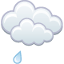                   |
| cloud_bright_rain_easy.png             | wet                                                | 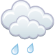                         |
| cloud_bright_rain_hard.png             | heavy rain                                         | 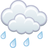                         |
| cloud_bright_rain_snow_easy.png        | changeable, light showers of rain or snow possible | 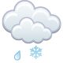               |
| cloud_bright_rain_snow_hard.png        | heavy snowfall and rain                            | 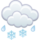               |
| cloud_bright_snow_drizzle.png          | light snow showers                                 | 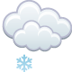                  |
| cloud_bright_snow_easy.png             | some snowfall                                      | 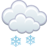                        |
| cloud_bright_snow_hard.png             | heavy snowfall                                     | 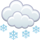                         |
| cloud_thunder_rain.png                 | overcast with thunderstorms                        | 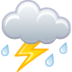                                 |
| cloud_thunder_rain_snow.png            | thunderstorms with rain or snow                    | 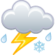                       |
| cloud_thunder_snow.png                 | thunderstorms with snow                            | 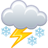                                 |
| cloudy_bright.png                      | overcast                                           |                                            |
| sun_bright_cloud.png                   | sunny                                              | 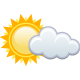                                     |
| sun_cloud_bright_rain_drizzle.png      | changeable, light showers possible                 | 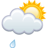           |
| sun_cloud_bright_rain_easy.png         | changeable, showers possible                       | 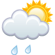                 |
| sun_cloud_bright_rain_hard.png         | wet, sunny spells possible                         | 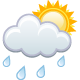                 |
| sun_cloud_bright_rain_snow_easy.png    | changeable, light showers of rain or snow possible | 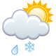       |
| sun_cloud_bright_rain_snow.png         | snowfall or rain, sunny spells possible            | 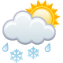                 |
| sun_cloud_bright_rain_snow_thunder.png | thundery showers of rain or snow possible          | 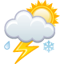 |
| sun_cloud_bright_rain_thunder.png      | thundery showers possible                          | 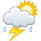           |
| sun_cloud_bright_snow_drizzle.png      | changeable, light snow showers possible            | 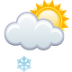           |
| sun_cloud_bright_snow_easy.png         | changeable, snow showers possible                  | 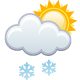                 |
| sun_cloud_bright_snow_hard.png         | snowfall, sunny spells possible                    | 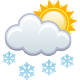                 |
| sun_cloud_bright_snow_thunder.png      | thundery snow showers possible                     | 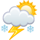           |
| sun_cloudy_bright.png                  | partly cloudy                                      | 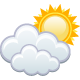                                   |
| sunny.png                              | cloudless                                          |                                                            |

## Latitude

Latitude of point the forecast was calculated for (in decimal degrees). Negative values refer to latitudes south of the equator.

## Longitude

Longitude of point the forecast was calculated for (in decimal degrees). Negative values refer to longitudes west of the zero meridian.

## LowerCloudLimit

Forecast of the cloud base height above sea level.

## MaximumFeltTemperature

Maximum [felt temperature](#felttemperature) within a forecast interval. The forecast interval length is determined by the time resolution of the forecast, and the interval ends with the respective forecast time. Go [here](forecast3hourly_example_1.md) for an explicit example of forecast times and parameters for intervals.

## MaximumRelativeHumidity

Maximum [relative humidity](#relativehumidity) within a forecast interval. The forecast interval length is determined by the time resolution of the forecast, and the interval ends with the respective forecast time. Go [here](forecast3hourly_example_1.md) for an explicit example of forecast times and parameters for intervals.

## MaximumSnowfallLine

Highest altitude above sea level, till which, within a given forcast time interval, precipitation can fall in form of rain. The forecast interval length is determined by the time resolution of the forecast, and the interval ends with the respective forecast time. Go [here](forecast3hourly_example_1.md) for an explicit example of forecast times and parameters for intervals.

## MaximumTemperature

Maximum temperature 2 meters above ground within a forecast interval. The forecast interval length is determined by the time resolution of the forecast, and the interval ends with the respective forecast time. Go [here](forecast3hourly_example_1.md) for an explicit example of forecast times and parameters for intervals.

## MaximumWetBulbTemperature

Maximum [wet bulb temperature](#wetbulbtemperature) within a forecast interval. The forecast interval length is determined by the time resolution of the forecast, and the interval ends with the respective forecast time. Go [here](forecast3hourly_example_1.md) for an explicit example of forecast times and parameters for intervals.

## MinimumFeltTemperature

Minimum [felt temperature](#felttemperature) within a forecast interval. The forecast interval length is determined by the time resolution of the forecast, and the interval ends with the respective forecast time. Go [here](forecast3hourly_example_1.md) for an explicit example of forecast times and parameters for intervals.

## MinimumRelativeHumidity

Minimum [relative humidity](#relativehumidity) within a forecast interval. The forecast interval length is determined by the time resolution of the forecast, and the interval ends with the respective forecast time. Go [here](forecast3hourly_example_1.md) for an explicit example of forecast times and parameters for intervals.

## MinimumSnowfallLine

Lowest altitude above sea level to which, within a given forcast time interval, precipitation is supposed to fall in form of snow. The forecast interval length is determined by the time resolution of the forecast, and the interval ends with the respective forecast time. Go [here](forecast3hourly_example_1.md) for an explicit example of forecast times and parameters for intervals.

## MinimumTemperature

Minimum temperature 2 meters above ground within a forecast interval. The forecast interval length is determined by the time resolution of the forecast, and the interval ends with the respective forecast time. Go [here](forecast3hourly_example_1.md) for an explicit example of forecast times and parameters for intervals.

## MinimumWetBulbTemperature

Minimum [wet bulb temperature](#wetbulbtemperature) within a forecast interval. The forecast interval length is determined by the time resolution of the forecast, and the interval ends with the respective forecast time. Go [here](forecast3hourly_example_1.md) for an explicit example of forecast times and parameters for intervals.

## Moonrise

Time of moonrise at point of interest in local time zone (ISO 8601 date format).

## Moonset

Time of moonset at point of interest in local time zone (ISO 8601 date format).

## MoonPhase

Moon phase at point of interest. Possible Values are:

| English         | German          |
| --------------- | --------------- |
| New Moon        | Neumond         |
| Waxing Crescent | Erstes Viertel  |
| Waxing Gibbous  | Zweites Viertel |
| Full Moon       | Vollmond        |
| Waning Gibbous  | Drittes Viertel |
| Waning Crescent | Viertes Viertel |

## PrecipitationProbability

Probability of precipitation greater than 0.2 mm/m² in the interval leading up to the corresponding forecast time. Go [here](forecast3hourly_example_1.md) for an explicit example of forecast times and parameters for intervals.

## PrecipitationRain_3hourlySum

Forecast three-hour rain sum at the point of interest. The interval length of the summation is 3 hours and ends with the correspondent forecast time. Go [here](forecast3hourly_example_1.md) for an explicit example of forecast times and parameters for intervals.

## PrecipitationRain_6hourlySum

Forecast six-hour rain sum at the point of interest. The interval length of the summation is 6 hours and ends with the correspondent forecast time. Go [here](forecast3hourly_example_1.md) for an explicit example of forecast times and parameters for intervals.

## PrecipitationRain_dailySum

Forecast daily rain sum at the point of interest. The interval length of the summation is 24 hours and ends with the correspondent forecast time. Go [here](forecast3hourly_example_1.md) for an explicit example of forecast times and parameters for intervals.

## PrecipitationRain_hourlySum

Forecast hourly rain sum at the point of interest. The interval length of the summation is one hour and ends with the correspondent forecast time. Go [here](forecast3hourly_example_1.md) for an explicit example of forecast times and parameters for intervals.

## PrecipitationRain_Intensity

Intensity of rainfall at point of interest for a given time.

## PrecipitationSnow_3hourlySum

Forecast three-hour fresh snow amount at the point of interest. The interval length of the summation is 3 hours and ends with the correspondent forecast time. Go [here](forecast3hourly_example_1.md) for an explicit example of forecast times and parameters for intervals.

## PrecipitationSnow_6hourlySum

Forecast six-hour snow sum at the point of interest. The interval length of the summation is 6 hours and ends with the correspondent forecast time. Go [here](forecast3hourly_example_1.md) for an explicit example of forecast times and parameters for intervals.

## PrecipitationSnow_dailySum

Forecast daily fresh snow amount at the point of interest. The interval length of the summation is 24 hours and ends with the correspondent forecast time. Go [here](forecast3hourly_example_1.md) for an explicit example of forecast times and parameters for intervals.

## PrecipitationSnow_hourlySum

Forecast hourly fresh snow sum at the point of interest. The interval length of the summation is one hour and ends with the correspondent forecast time. Go [here](forecast3hourly_example_1.md) for an explicit example of forecast times and parameters for intervals.

## PrecipitationSnow_Sum

Forecast snow sum at the point of interest. The interval length is determined by the forecast resolution and ends with the corresponding forecast time.

## PrecipitationSnow_Intensity

Intensity of snowfall at point of interest for a given time.

## PrecipitationTotal_3hourlySum

Forecast three-hour sum of total precipitation (rain and/or water equivalent of snow). The interval length of the summation is 3 hours and ends with the correspondent forecast time. Go [here](forecast3hourly_example_1.md) for an explicit example of forecast times and parameters for intervals.

## PrecipitationTotal_6hourlySum

Forecast six-hour total precipitation (rain and/or water equivalent of snow) sum at the point of interest. The interval length of the summaation is 6 hours and ends with the correspondent forecast time. Go [here](forecast3hourly_example_1.md) for an explicit example of forecast times and parameters for intervals.

## PrecipitationTotal_dailySum

Forecast daily total precipitation amount (rain and/or water equivalent of snow) at the point of interest. The interval length of the summation is 24 hours and ends with the correspondent forecast time. Go [here](forecast3hourly_example_1.md) for an explicit example of forecast times and parameters for intervals.

## PrecipitationTotal_hourlySum

Forecast hourly total precipitation (rain and/or water equivalent of snow) sum at the point of interest. The interval length of the summation is one hour and ends with the correspondent forecast time. Go [here](forecast3hourly_example_1.md) for an explicit example of forecast times and parameters for intervals.

## PrecipitationTotal_Intensity

Intensity of total precipitation (rain and/or water equivalent of snow) at the point of interest for a given time.

## PrecipitationType

String expressing the kind of precipitation that is forecast. Possible values are `rain`, `snow` and `sleet`.

## RelativeHumidity

Relative humidity at point of interest, 2 meters above ground.

## MeanRelativeHumidity

Mean [relative humidity](#relativehumidity) within a forecast interval. The forecast interval length is determined by the time resolution of the forecast, and the interval ends with the respective forecast time.

## SnowfallLine

Altitude above mean sea level to which precipitation falls in form of snow.

## SunshineDuration_dailySum

Duration of sunshine occurring at the point of interest during a given daily forecast interval. The interval length is 24 hours and ends with the respective forecast time.

## SunshineDuration_hourlySum

Duration of sunshine occurring at the point of interest during a given hourly forecast interval. The interval length is one hour and ends with the respective forecast time.

## SunshineDuration_3hourlySum

Duration of sunshine occurring at the point of interest during a given 3-hour forecast interval. The interval length is 3 hours and ends with the respective forecast time.

## SunshineDuration_6hourlySum

Duration of sunshine occurring at the point of interest during a given 6-hour forecast interval. The interval length is 6 hours and ends with the respective forecast time.

## Sunrise

Time of sunrise at point of interest in local time zone (ISO 8601 date format).

## Sunset

Time of sunset at point of interest in local time zone (ISO 8601 date format).

## Temperature

Air temperature at point of interest for a given time, 2 meters above ground.

## LongText

Verbal description of the weather for one day, includes minimum and maximum temperatures.

## ThunderstormProbability

General description of thunderstorm risk for the interval leading up to the corresponding forecast time at the point of interest. Possible values are `low`, `moderate`, `high` and `extreme`. Go [here](forecast3hourly_example_1.md) for an explicit example of forecast times and parameters for intervals.

## TotalCloudCover

Forecast of the total cloud cover at the point of interest.

## MinimumTotalCloudCover

Minimum value of total cloud cover over the associated time span.

## MeanTotalCloudCover

Mean value of total cloud cover over the associated time span.

## MaximumTotalCloudCover

Maximum value of total cloud cover over the associated time span.

## UpperCloudLimit

Forecast of the maximum height of the clouds at the point of interest.

## ShortText

Short verbal description of forecasted weather.

## WetBulbTemperature

Wet bulb temperature at point of interest for a given time, 2 meters above ground. The wet bulb temperature is the temperature of adiabatic saturation. This is the temperature indicated by a moistened thermometer bulb exposed to the air flow.

## WindDirectionAtMaxSpeed

Wind direction associated with the maximum wind speed within the forecast interval.

## WindDirection

Main direction the wind blows from, e.g. north wind blows from the north. The wind direction is taken from an eight part compass rose. Possible values are `N`, `NE`, `E`, `SE`, `S`, `SW`, `W` and `NW`. In the occurrence of calm conditions and/or circulating wind, the value `XX` is used.

## WindSpeed

Ten-minute average of wind speed 10 meters above ground. Attention: gusts may reach more than twice that speed.

## MinimumWindSpeed

Minimum value of 10-minute averaged wind speed over the respective period.

## MaximumWindSpeed

Maximum value of 10-minute averaged wind speed over the respective period.

## MaximumWindStrength

Maximum wind strength over the associated time span, represented using Beaufort scale classes.

## MaximumWindGust

Maximum wind gust over the associated time span.

## WindStrength

Verbal description of occurring wind speed, based on the internationally renowned Beaufort scale. Values: `low`, `moderate`, `high` and `extreme`.

## ZeroDegreeIsothermHeight

Forecast of the height above sea level at which the 0°C isotherm will be at the point of interest.

