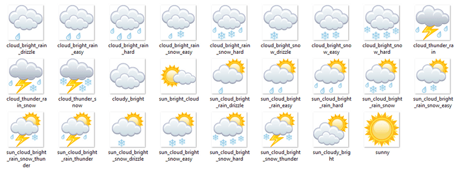

# MetGIS Point API


The MetGIS Point API is an application programming interface that can be used to access current and forecast weather data in JSON format. This document provides a detailed description of its usage. Information about obtaining access rights to it can be found [here](https://weatherapi.metgis.com/) (English) or [here](https://wetterapi.metgis.com/overview/) (German).

## Quick Start

The API is accessed via HTTP-GET using an URL of the following form:
```
https://point-api.metgis.com/forecast?key={your-key}&lat={latitude}&lon={longitude}&alt={altitude}&lang={language}&v={package-version}
```

The geographic location for which the data is requested for can also be transmitted by specifying a postcode and country in the request, omitting the parameters lat, lon and alt:
```
https://point-api.metgis.com/forecast?key={your-key}&zip={postcode}&country={country}&v={package-version}
```
**Important**: Forecasts for postcodes can only be requested for points in Switzerland, Austria and Germany!

The parameters that have to be set are in in curly brackets and listed in the following table:


Parameter | Description | Comments 
------- | :------: | ---------
key | Key needed to access MetGIS point API | Paying customers have received their API Key after ordering. Information about the collection of free test keys can be found [here](https://weatherapi.metgis.com/get-free-developer-key/). Mandadory parameter.
lat | Latitude of point the weather data is requested for in degrees [°] | Latitude of points south of the equator is negative, use point (.) as decimal separator. Mandatory parameter if no postcode and country is specified.
lon | Longitude of point the weather data is requested for in degrees [°] | Longitude west of 0° meridian can be given as negative values or in the range from 180° to 360°, use point (.) as decimal separator. Mandatory parameter if no postcode and country is specified.
alt | Altitude of point the weather data is requested for in meters above sea level  | Optional parameter. If no altitude is given, our computations will use height data from [ASTER data, Version 3 (30m horizontal resolution)](https://earthdata.nasa.gov/learn/articles/new-aster-gdem)
zip | Postcode of point the weather data is requested for. | Service can only be used for points in Switzerland, Austria and Germany. Mandatory parameter if no latitude and longitude is specified. 
country | Country of point the weather data is requested for. Can either be `ch`, `at` or `de` | Service can only be used for points in Switzerland, Austria and Germany. Mandatory parameter if no latitude and longitude is specified.  
v | Name of requested weather data package | Key must have access rights to requested package, for available package versions check the table in section [package versions](#package-versions). Mandatory parameter.
lang | Language select key | Optional parameter. Can be used to change the language in text forecasts for certain packages. Can be either `de` for German (default), `en` for English or `es` for Spanish. 
fctime | Parameter to specify date and time for the package version `fctisl`. | Format of this parameter is `yyyymmddHHMM`, e. g. `202204172230` for the 17th of April 2022 at half past ten in the evening (UTC time!). Mandatory parameter for the package `fctisl`.

A valid request will be responded with a file in JSON format that contains the weather data. The files are mostly self explaining, but a detailed description of the available packages is given [in the next section](#package-versions). Please remember that data elements of JSON files generally do not contain any particular order. Thus the file can look a bit messed up at first. The units for all the parameters are specified in the file.


The next section will explain the different available weather data packages, while the section [common errors](#common-errors) will try to provide help in case anything goes wrong.

## Package Versions

### Overview

The following table presents an overview of weather data packages available from the MetGIS Point API.

The packages differ in terms of:
* Forecast range: This stands for the time period a forecast covers. MetGIS weather forecasts currently reach out up to 14 days in the future.
* Time resolution: This stands for the available interval of forecast time steps (1, 3, 6 or 24 hours). 
* Forecast parameters: A wide range of forecast parameters are available via the MetGIS Point API. Check this [compilation](data/variable_list_point_api_new.md) for more details.

| Package Version | Description | Optional Parameters |
| ---- | :----: | ----- |
| [current](#package-current) | Weather data for the current moment at location of interest | alt, lang |
| [starter](#package-starter) | Forecast weather data for the location of interest. Forecasts in 3-hourly and daily resolution included | alt, lang |
| [smart](#package-smart) | Current and forecast weather data  for the location of interest. Forecasts in 3-hourly and daily resolution included | alt, lang |
| [premium](#package-premium) | Current and extended weather forecast data for the location of interest. Forecasts in hourly, 3-, 6-hourly and daily resolution | alt, lang |
| [coldweather](#package-coldweather) | Current and extended weather forecast data for the location of interest. Forecasts in hourly, 3-, 6-hourly and daily resolution. This forecast incorporates special "winter" parameters like fresh snow density and the height of the 0°C isotherm | alt, lang | 
| [fctisl](#package-fctisl) | Weather forecast data for a specific time, very compact. | alt, lang |
| [solar24](#package-solar24) | Radiation, temperature and precipitation forecast for the next 24 hours. | alt |
| [solarD3](#package-solarD3) | Radiation and temperature forecast for the next 3 days. | alt |
| [solarD9](#package-solarD9) | Radiation and temperature forecast for the next 9 days. | alt |

Alongside most parameters, the JSON response includes one or two companion fields with the same name plus a suffix:

- `<ParameterName>_unit` — present for numeric parameters. Contains the physical unit of that parameter as a string, e.g. `Temperature_unit`: `"°C"`.
- `<ParameterName>_usedValues` — present for parameters that only take one of a fixed, limited set of string values (e.g. `WindDirection`, `MoonPhase`, `PrecipitationType`). Contains an array listing every value the parameter can take.

The following sections describe the available packages:

### Package current

The response JSON describes the current state of the weather at the point of interest. It can be retrieved by calling the API like this:
```
https://point-api.metgis.com/forecast?key={your-key}&lat={latitude}&lon={longitude}&v=current
```
This table gives an overview of what is included in this package:
| Item | Included Parameters | Forecast Range | Time Resolution |
| --- | ------ | :-----: | :-----: |
| Info | [Altitude_[m]](data/variable_list_point_api_new.md#altitude_m), [Description](data/variable_list_point_api_new.md#description), [Forecast_Calculated_LocalTime](data/variable_list_point_api_new.md#forecast_calculated_localtime), [Forecast_Calculated_UTC](data/variable_list_point_api_new.md#forecast_calculated_utc), [Latitude](data/variable_list_point_api_new.md#latitude), [Longitude](data/variable_list_point_api_new.md#longitude) | - | - |
| Current | [Icon](data/variable_list_point_api_new.md#icon), [MoonPhase](data/variable_list_point_api_new.md#moonphase), [Moonrise](data/variable_list_point_api_new.md#moonrise), [Moonset](data/variable_list_point_api_new.md#moonset), [PrecipitationRain_Intensity](data/variable_list_point_api_new.md#precipitationrain_intensity), [PrecipitationSnow_Intensity](data/variable_list_point_api_new.md#precipitationsnow_intensity), [PrecipitationTotal_Intensity](data/variable_list_point_api_new.md#precipitationtotal_intensity), [Sunrise](data/variable_list_point_api_new.md#sunrise), [Sunset](data/variable_list_point_api_new.md#sunset), [Temperature](data/variable_list_point_api_new.md#temperature), [WindDirection](data/variable_list_point_api_new.md#winddirection), [WindSpeed](data/variable_list_point_api_new.md#windspeed), [WindStrength](data/variable_list_point_api_new.md#windstrength), [WeatherDescription](data/variable_list_point_api_new.md#weatherdescription) | - | - |

This [example file](data_metgis_point_API_reference/current.json) shows what a response JSON looks like.

For the units and possible values of the forecast variables, see `<ParameterName>_unit` and `<ParameterName>_usedValues`.

The response file consists of the objects `Info` that contains the geographic coordinates of the point of interest and the time the forecast is valid for, and `Current`, which holds the actual weather parameters and their descriptions. The current weather data is obtained from surrounding observations and numerical weather prediction model data for the time at which the request is happening.


### Package starter

Requesting this data package yields a JSON format answer, with forecast weather data for any point of interest. It can be requested like this:
```
https://point-api.metgis.com/forecast?key={your-key}&lat={latitude}&lon={longitude}&v=starter
``` 
This table gives an overview of the information included in this package:


| Item | Included Parameters | Forecast Range | Time Resolution |
| --- | ------ | :-----: | :-----: |
| Info | [Altitude_[m]](data/variable_list_point_api_new.md#altitude_m), [Description](data/variable_list_point_api_new.md#description), [Forecast_Calculated_LocalTime](data/variable_list_point_api_new.md#forecast_calculated_localtime), [Forecast_Calculated_UTC](data/variable_list_point_api_new.md#forecast_calculated_utc), [Latitude](data/variable_list_point_api_new.md#latitude), [Longitude](data/variable_list_point_api_new.md#longitude) | - | - |
| Forecast_3hourly | [ForecastTimes_LocalTime](data/variable_list_point_api_new.md#forecasttimes_localtime), [Icon](data/variable_list_point_api_new.md#icon), [PrecipitationTotal_3hourlySum](data/variable_list_point_api_new.md#precipitationtotal_3hourlysum), [Temperature](data/variable_list_point_api_new.md#temperature), [WeatherDescription](data/variable_list_point_api_new.md#weatherdescription), [WindDirection](data/variable_list_point_api_new.md#winddirection), [WindSpeed](data/variable_list_point_api_new.md#windspeed) | 1 day | 3 hours |
| Forecast_daily | [ForecastTimes_LocalTime](data/variable_list_point_api_new.md#forecasttimes_localtime), [Icon](data/variable_list_point_api_new.md#icon), [MaximumTemperature](data/variable_list_point_api_new.md#maximumtemperature), [MaximumWindGust](data/variable_list_point_api_new.md#maximumwindgust), [MaximumWindSpeed](data/variable_list_point_api_new.md#maximumwindspeed), [MaximumWindStrength](data/variable_list_point_api_new.md#maximumwindstrength), [MinimumTemperature](data/variable_list_point_api_new.md#minimumtemperature), [MinimumWindSpeed](data/variable_list_point_api_new.md#minimumwindspeed), [PrecipitationTotal_dailySum](data/variable_list_point_api_new.md#precipitationtotal_dailysum), [WindDirectionAtMaxSpeed](data/variable_list_point_api_new.md#winddirectionatmaxspeed), [WeatherDescription](data/variable_list_point_api_new.md#weatherdescription) | 3 days | 1 day |

What the response JSON looks like is shown in this [example file](data_metgis_point_API_reference/starter.json).

For the units and possible values of the forecast variables, see `<ParameterName>_unit` and `<ParameterName>_usedValues`.

The response file consists of the objects `Info`, `Forecast_3hourly` and `Forecast_daily`. 

`Info` contains a general description of the data, geographic information of the point of interest and the date and time when the forecast was calculated.

`Forecast_3hourly` contains arrays of weather forecast data for the next 24 hours, in 3-hourly resolution, and an array with the times and dates the predictions are valid for.

The object `Forecast_daily` contains weather parameters describing the weather over periods of 24 hours for the next three days. Included are sums, minimum and maximum values of certain parameters and a weather icon code describing the weather character on given day.

### Package smart

Requesting this data package yields a JSON format answer, with forecast and current weather data for any point of interest. It can be requested like this:
```
https://point-api.metgis.com/forecast?key={your-key}&lat={latitude}&lon={longitude}&v=smart
``` 
This table gives an overview of the information included in this package:


| Item | Included Parameters | Forecast Range | Time Resolution |
| --- | ------ | :-----: | :-----: |
| Info | [Altitude_[m]](data/variable_list_point_api_new.md#altitude_m), [Description](data/variable_list_point_api_new.md#description), [Forecast_Calculated_LocalTime](data/variable_list_point_api_new.md#forecast_calculated_localtime), [Forecast_Calculated_UTC](data/variable_list_point_api_new.md#forecast_calculated_utc), [Latitude](data/variable_list_point_api_new.md#latitude), [Longitude](data/variable_list_point_api_new.md#longitude) | - | - |
| Current | [Icon](data/variable_list_point_api_new.md#icon), [MoonPhase](data/variable_list_point_api_new.md#moonphase), [Moonrise](data/variable_list_point_api_new.md#moonrise), [Moonset](data/variable_list_point_api_new.md#moonset), [PrecipitationRain_Intensity](data/variable_list_point_api_new.md#precipitationrain_intensity), [PrecipitationSnow_Intensity](data/variable_list_point_api_new.md#precipitationsnow_intensity), [PrecipitationTotal_Intensity](data/variable_list_point_api_new.md#precipitationtotal_intensity), [Sunrise](data/variable_list_point_api_new.md#sunrise), [Sunset](data/variable_list_point_api_new.md#sunset), [Temperature](data/variable_list_point_api_new.md#temperature), [TotalCloudCover](data/variable_list_point_api_new.md#totalcloudcover), [WeatherDescription](data/variable_list_point_api_new.md#weatherdescription), [WindDirection](data/variable_list_point_api_new.md#winddirection), [WindSpeed](data/variable_list_point_api_new.md#windspeed), [WindStrength](data/variable_list_point_api_new.md#windstrength) | - | - |
| Forecast_3hourly | [ForecastTimes_LocalTime](data/variable_list_point_api_new.md#forecasttimes_localtime), [Icon](data/variable_list_point_api_new.md#icon), [PrecipitationProbability](data/variable_list_point_api_new.md#precipitationprobability), [PrecipitationRain_3hourlySum](data/variable_list_point_api_new.md#precipitationrain_3hourlysum), [PrecipitationSnow_3hourlySum](data/variable_list_point_api_new.md#precipitationsnow_3hourlysum), [PrecipitationTotal_3hourlySum](data/variable_list_point_api_new.md#precipitationtotal_3hourlysum), [Temperature](data/variable_list_point_api_new.md#temperature), [ThunderstormProbability](data/variable_list_point_api_new.md#thunderstormprobability), [TotalCloudCover](data/variable_list_point_api_new.md#totalcloudcover), [WeatherDescription](data/variable_list_point_api_new.md#weatherdescription), [WindDirection](data/variable_list_point_api_new.md#winddirection), [WindSpeed](data/variable_list_point_api_new.md#windspeed), [WindStrength](data/variable_list_point_api_new.md#windstrength) | 3 days | 3 hours |
| Forecast_daily | [ForecastTimes_LocalTime](data/variable_list_point_api_new.md#forecasttimes_localtime), [Icon](data/variable_list_point_api_new.md#icon), [MaximumTemperature](data/variable_list_point_api_new.md#maximumtemperature), [MaximumWindGust](data/variable_list_point_api_new.md#maximumwindgust), [MaximumWindSpeed](data/variable_list_point_api_new.md#maximumwindspeed), [MaximumWindStrength](data/variable_list_point_api_new.md#maximumwindstrength), [MinimumTemperature](data/variable_list_point_api_new.md#minimumtemperature), [MinimumWindSpeed](data/variable_list_point_api_new.md#minimumwindspeed), [PrecipitationProbability](data/variable_list_point_api_new.md#precipitationprobability), [PrecipitationRain_dailySum](data/variable_list_point_api_new.md#precipitationrain_dailysum), [PrecipitationSnow_dailySum](data/variable_list_point_api_new.md#precipitationsnow_dailysum), [PrecipitationTotal_dailySum](data/variable_list_point_api_new.md#precipitationtotal_dailysum), [Sunrise](data/variable_list_point_api_new.md#sunrise), [Sunset](data/variable_list_point_api_new.md#sunset), [ThunderstormProbability](data/variable_list_point_api_new.md#thunderstormprobability), [WeatherDescription](data/variable_list_point_api_new.md#weatherdescription), [WindDirectionAtMaxSpeed](data/variable_list_point_api_new.md#winddirectionatmaxspeed), [MinimumTotalCloudCover](data/variable_list_point_api_new.md#minimumtotalcloudcover), [MeanTotalCloudCover](data/variable_list_point_api_new.md#meantotalcloudcover), [MaximumTotalCloudCover](data/variable_list_point_api_new.md#maximumtotalcloudcover) | 8 days | 1 day |


What the response JSON looks like is shown in this [example file](data_metgis_point_API_reference/smart.json).

For the units and possible values of the forecast variables, see `<ParameterName>_unit` and `<ParameterName>_usedValues`.

The response file consists of the objects `Info`, `Current`, `Forecast_3hourly` and `Forecast_daily`. 

`Info` contains a general description of the data, geographic information of the point of interest and the date and time when the forecast was calculated.

The Object `Current` provides information about the current weather conditions at the specified location at the time of the data request. It is obtained from surrounding observations and numerical weather prediction model data.

`Forecast_3hourly` contains arrays of weather forecast data for the next 3 days, in 3-hourly resolution, and an array with the times and dates the predictions are valid for.

The object `Forecast_daily` contains weather parameters describing the weather over periods of 24 hours for the next eight days. Included are sums, minimum and maximum values of certain parameters and a weather icon code describing the weather character on given day.


### Package premium

This package contains detailed weather forecast data in different temporal resolutions. It can be requested with a URL of the following form:

```
https://point-api.metgis.com/forecast?key={your-key}&lat={latitude}&lon={longitude}&v=premium&lang={en|de|es}
```
Like in the other packages, the query parameter `lang` can be used to request the weather forecasts text in English language if set to `en` or in Spanish if set to `es`. The default value is `de` for German. As with all other packages the `alt` parameter can be used if very accurate geographic data is available, otherwise the height above sea level will be interpolated from [ASTER data, Version 3 (30m horizontal resolution)](https://earthdata.nasa.gov/learn/articles/new-aster-gdem).

The following table provides an overview of the information contained in this package:
| Item | Included Parameters | Forecast Range | Time Resolution |
| --- | ------ | :-----: | :-----: |
| Info | [Altitude_[m]](data/variable_list_point_api_new.md#altitude_m), [Description](data/variable_list_point_api_new.md#description), [Forecast_Calculated_LocalTime](data/variable_list_point_api_new.md#forecast_calculated_localtime), [Forecast_Calculated_UTC](data/variable_list_point_api_new.md#forecast_calculated_utc), [Latitude](data/variable_list_point_api_new.md#latitude), [Longitude](data/variable_list_point_api_new.md#longitude) | - | - |
| Current | [FeltTemperature](data/variable_list_point_api_new.md#felttemperature), [Icon](data/variable_list_point_api_new.md#icon), [MoonPhase](data/variable_list_point_api_new.md#moonphase), [Moonrise](data/variable_list_point_api_new.md#moonrise), [Moonset](data/variable_list_point_api_new.md#moonset), [PrecipitationRain_Intensity](data/variable_list_point_api_new.md#precipitationrain_intensity), [PrecipitationSnow_Intensity](data/variable_list_point_api_new.md#precipitationsnow_intensity), [PrecipitationTotal_Intensity](data/variable_list_point_api_new.md#precipitationtotal_intensity), [RelativeHumidity](data/variable_list_point_api_new.md#relativehumidity), [Sunrise](data/variable_list_point_api_new.md#sunrise), [Sunset](data/variable_list_point_api_new.md#sunset), [Temperature](data/variable_list_point_api_new.md#temperature), [TotalCloudCover](data/variable_list_point_api_new.md#totalcloudcover), [WeatherDescription](data/variable_list_point_api_new.md#weatherdescription), [WindDirection](data/variable_list_point_api_new.md#winddirection), [WindSpeed](data/variable_list_point_api_new.md#windspeed), [WindStrength](data/variable_list_point_api_new.md#windstrength) | - | - |
| Forecast_hourly | [FeltTemperature](data/variable_list_point_api_new.md#felttemperature), [ForecastTimes_LocalTime](data/variable_list_point_api_new.md#forecasttimes_localtime), [Icon](data/variable_list_point_api_new.md#icon), [PrecipitationRain_hourlySum](data/variable_list_point_api_new.md#precipitationrain_hourlysum), [PrecipitationSnow_hourlySum](data/variable_list_point_api_new.md#precipitationsnow_hourlysum), [PrecipitationTotal_hourlySum](data/variable_list_point_api_new.md#precipitationtotal_hourlysum), [RelativeHumidity](data/variable_list_point_api_new.md#relativehumidity), [SunshineDuration_hourlySum](data/variable_list_point_api_new.md#sunshineduration_hourlysum), [Temperature](data/variable_list_point_api_new.md#temperature), [ThunderstormProbability](data/variable_list_point_api_new.md#thunderstormprobability), [TotalCloudCover](data/variable_list_point_api_new.md#totalcloudcover), [WeatherDescription](data/variable_list_point_api_new.md#weatherdescription), [WindDirection](data/variable_list_point_api_new.md#winddirection), [WindSpeed](data/variable_list_point_api_new.md#windspeed), [WindStrength](data/variable_list_point_api_new.md#windstrength) | 4 days | 1 hour |
| Forecast_3hourly | [FeltTemperature](data/variable_list_point_api_new.md#felttemperature), [ForecastTimes_LocalTime](data/variable_list_point_api_new.md#forecasttimes_localtime), [Icon](data/variable_list_point_api_new.md#icon), [PrecipitationProbability](data/variable_list_point_api_new.md#precipitationprobability), [PrecipitationRain_3hourlySum](data/variable_list_point_api_new.md#precipitationrain_3hourlysum), [PrecipitationSnow_3hourlySum](data/variable_list_point_api_new.md#precipitationsnow_3hourlysum), [PrecipitationTotal_3hourlySum](data/variable_list_point_api_new.md#precipitationtotal_3hourlysum), [RelativeHumidity](data/variable_list_point_api_new.md#relativehumidity), [SunshineDuration_3hourlySum](data/variable_list_point_api_new.md#sunshineduration_3hourlysum), [Temperature](data/variable_list_point_api_new.md#temperature), [ThunderstormProbability](data/variable_list_point_api_new.md#thunderstormprobability), [TotalCloudCover](data/variable_list_point_api_new.md#totalcloudcover), [WeatherDescription](data/variable_list_point_api_new.md#weatherdescription), [WindDirection](data/variable_list_point_api_new.md#winddirection), [WindSpeed](data/variable_list_point_api_new.md#windspeed), [WindStrength](data/variable_list_point_api_new.md#windstrength) | 9 days and 12 hours | 3 hours |
| Forecast_6hourly | [FeltTemperature](data/variable_list_point_api_new.md#felttemperature), [ForecastTimes_LocalTime](data/variable_list_point_api_new.md#forecasttimes_localtime), [Icon](data/variable_list_point_api_new.md#icon), [PrecipitationProbability](data/variable_list_point_api_new.md#precipitationprobability), [PrecipitationRain_6hourlySum](data/variable_list_point_api_new.md#precipitationrain_6hourlysum), [PrecipitationSnow_6hourlySum](data/variable_list_point_api_new.md#precipitationsnow_6hourlysum), [PrecipitationTotal_6hourlySum](data/variable_list_point_api_new.md#precipitationtotal_6hourlysum), [RelativeHumidity](data/variable_list_point_api_new.md#relativehumidity), [SunshineDuration_6hourlySum](data/variable_list_point_api_new.md#sunshineduration_6hourlysum), [Temperature](data/variable_list_point_api_new.md#temperature), [ThunderstormProbability](data/variable_list_point_api_new.md#thunderstormprobability), [TotalCloudCover](data/variable_list_point_api_new.md#totalcloudcover), [WeatherDescription](data/variable_list_point_api_new.md#weatherdescription), [WindDirection](data/variable_list_point_api_new.md#winddirection), [WindSpeed](data/variable_list_point_api_new.md#windspeed), [WindStrength](data/variable_list_point_api_new.md#windstrength) | 9 days and 12 hours | 6 hours |
| Forecast_daily | [ForecastTimes_LocalTime](data/variable_list_point_api_new.md#forecasttimes_localtime), [Icon](data/variable_list_point_api_new.md#icon), [MaximumTemperature](data/variable_list_point_api_new.md#maximumtemperature), [MaximumWindGust](data/variable_list_point_api_new.md#maximumwindgust), [MaximumWindSpeed](data/variable_list_point_api_new.md#maximumwindspeed), [MaximumWindStrength](data/variable_list_point_api_new.md#maximumwindstrength), [MeanRelativeHumidity](data/variable_list_point_api_new.md#meanrelativehumidity), [MaximumFeltTemperature](data/variable_list_point_api_new.md#maximumfelttemperature), [MinimumFeltTemperature](data/variable_list_point_api_new.md#minimumfelttemperature), [MinimumTemperature](data/variable_list_point_api_new.md#minimumtemperature), [MinimumWindSpeed](data/variable_list_point_api_new.md#minimumwindspeed), [MoonPhase](data/variable_list_point_api_new.md#moonphase), [Moonrise](data/variable_list_point_api_new.md#moonrise), [Moonset](data/variable_list_point_api_new.md#moonset), [PrecipitationProbability](data/variable_list_point_api_new.md#precipitationprobability), [PrecipitationRain_dailySum](data/variable_list_point_api_new.md#precipitationrain_dailysum), [PrecipitationSnow_dailySum](data/variable_list_point_api_new.md#precipitationsnow_dailysum), [PrecipitationTotal_dailySum](data/variable_list_point_api_new.md#precipitationtotal_dailysum), [Sunrise](data/variable_list_point_api_new.md#sunrise), [Sunset](data/variable_list_point_api_new.md#sunset), [SunshineDuration_dailySum](data/variable_list_point_api_new.md#sunshineduration_dailysum) [TextForecast](data/variable_list_point_api_new.md#textforecast), [ThunderstormProbability](data/variable_list_point_api_new.md#thunderstormprobability), [MinimumTotalCloudCover](data/variable_list_point_api_new.md#minimumtotalcloudcover), [MeanTotalCloudCover](data/variable_list_point_api_new.md#meantotalcloudcover), [MaximumTotalCloudCover](data/variable_list_point_api_new.md#maximumtotalcloudcover), [WeatherDescription](data/variable_list_point_api_new.md#weatherdescription), [WindDirectionAtMaxSpeed](data/variable_list_point_api_new.md#winddirectionatmaxspeed) | 14 days | 1 day |

 
What a response JSON looks like is shown in this [example](data_metgis_point_API_reference/premium.json).

For the units and possible values of the forecast variables, see `<ParameterName>_unit` and `<ParameterName>_usedValues`.

The response file contains the JSON Objects listed in column Item in the table above.

`Info` contains a general description of the data, geographic information of the point of interest and the date and time when the forecast was calculated.

The Object `Current` provides information about the current weather conditions at the specified location at the time of the data request. It is obtained from surrounding observations and numerical weather prediction model data.

`Forecast_3hourly` contains arrays of weather forecast data for the next 9 days and 12 hours, in 3-hourly resolution, and an array with the times and dates the predictions are valid for.

`Forecast_6hourly` covers the same needs as `Forecast_3hourly` but with a temporal resolution of 6 hours.

The object `Forecast_daily` contains weather parameters describing the weather over periods of 24 hours for the next 14 days. Included are sums, minimum and maximum values of certain parameters and a weather icon code describing the weather character on the given days.


### Package coldweather

Requesting this data package yields a JSON format answer, with forecast and current weather data for any point of interest. On top of an extended variety of conventional forecast data, special parameters that are important in cold and snowy conditions are included. It can be requested like this:
```
https://point-api.metgis.com/forecast?key={your-key}&lat={latitude}&lon={longitude}&v=coldweather
``` 
This table gives an overview of the information included in this package:


| Item | Included Parameters | Forecast Range | Time Resolution |
| --- | ------ | :-----: | :-----: |
| Info | [Altitude_[m]](data/variable_list_point_api_new.md#altitude_m), [Description](data/variable_list_point_api_new.md#description), [Forecast_Calculated_LocalTime](data/variable_list_point_api_new.md#forecast_calculated_localtime), [Forecast_Calculated_UTC](data/variable_list_point_api_new.md#forecast_calculated_utc), [Latitude](data/variable_list_point_api_new.md#latitude), [Longitude](data/variable_list_point_api_new.md#longitude) | - | - |
| Current | [FeltTemperature](data/variable_list_point_api_new.md#felttemperature), [FreshSnowDensity](data/variable_list_point_api_new.md#freshsnowdensity), [Icon](data/variable_list_point_api_new.md#icon), [LowerCloudLimit](data/variable_list_point_api_new.md#lowercloudlimit), [MoonPhase](data/variable_list_point_api_new.md#moonphase), [Moonrise](data/variable_list_point_api_new.md#moonrise), [Moonset](data/variable_list_point_api_new.md#moonset), [PrecipitationRain_Intensity](data/variable_list_point_api_new.md#precipitationrain_intensity), [PrecipitationSnow_Intensity](data/variable_list_point_api_new.md#precipitationsnow_intensity), [PrecipitationTotal_Intensity](data/variable_list_point_api_new.md#precipitationtotal_intensity), [PrecipitationType](data/variable_list_point_api_new.md#precipitationtype), [RelativeHumidity](data/variable_list_point_api_new.md#relativehumidity), [SnowfallLine](data/variable_list_point_api_new.md#snowfallline), [Sunrise](data/variable_list_point_api_new.md#sunrise), [Sunset](data/variable_list_point_api_new.md#sunset), [Temperature](data/variable_list_point_api_new.md#temperature), [TotalCloudCover](data/variable_list_point_api_new.md#totalcloudcover), [UpperCloudLimit](data/variable_list_point_api_new.md#uppercloudlimit), [WeatherDescription](data/variable_list_point_api_new.md#weatherdescription), [WetBulbTemperature](data/variable_list_point_api_new.md#wetbulbtemperature), [WindDirection](data/variable_list_point_api_new.md#winddirection), [WindSpeed](data/variable_list_point_api_new.md#windspeed), [WindStrength](data/variable_list_point_api_new.md#windstrength), [ZeroDegreeIsothermHeight](data/variable_list_point_api_new.md#zerodegreeisothermheight) | - | - |
| Forecast_hourly | [FeltTemperature](data/variable_list_point_api_new.md#felttemperature), [ForecastTimes_LocalTime](data/variable_list_point_api_new.md#forecasttimes_localtime), [FreshSnowDensity](data/variable_list_point_api_new.md#freshsnowdensity), [Icon](data/variable_list_point_api_new.md#icon), [LowerCloudLimit](data/variable_list_point_api_new.md#lowercloudlimit), [PrecipitationRain_hourlySum](data/variable_list_point_api_new.md#precipitationrain_hourlysum), [PrecipitationSnow_Sum](data/variable_list_point_api_new.md#precipitationsnow_sum), [PrecipitationSnow_hourlySum](data/variable_list_point_api_new.md#precipitationsnow_hourlysum), [PrecipitationTotal_hourlySum](data/variable_list_point_api_new.md#precipitationtotal_hourlysum), [PrecipitationType](data/variable_list_point_api_new.md#precipitationtype), [RelativeHumidity](data/variable_list_point_api_new.md#relativehumidity), [SnowfallLine](data/variable_list_point_api_new.md#snowfallline), [SunshineDuration_hourlySum](data/variable_list_point_api_new.md#sunshineduration_hourlysum), [Temperature](data/variable_list_point_api_new.md#temperature), [ThunderstormProbability](data/variable_list_point_api_new.md#thunderstormprobability), [TotalCloudCover](data/variable_list_point_api_new.md#totalcloudcover), [UpperCloudLimit](data/variable_list_point_api_new.md#uppercloudlimit), [WeatherDescription](data/variable_list_point_api_new.md#weatherdescription), [WetBulbTemperature](data/variable_list_point_api_new.md#wetbulbtemperature), [WindDirection](data/variable_list_point_api_new.md#winddirection), [WindSpeed](data/variable_list_point_api_new.md#windspeed), [WindStrength](data/variable_list_point_api_new.md#windstrength), [ZeroDegreeIsothermHeight](data/variable_list_point_api_new.md#zerodegreeisothermheight), [DownwardShortWaveRadiation](data/variable_list_point_api_new.md#downwardshortwaveradiation), [DewPointTemperature](data/variable_list_point_api_new.md#dewpointtemperature) | 4 days | 1 hour |
| Forecast_3hourly | [FeltTemperature](data/variable_list_point_api_new.md#felttemperature), [ForecastTimes_LocalTime](data/variable_list_point_api_new.md#forecasttimes_localtime), [FreshSnowDensity](data/variable_list_point_api_new.md#freshsnowdensity), [Icon](data/variable_list_point_api_new.md#icon), [LowerCloudLimit](data/variable_list_point_api_new.md#lowercloudlimit), [MaximumFeltTemperature](data/variable_list_point_api_new.md#maximumfelttemperature), [MaximumRelativeHumidity](data/variable_list_point_api_new.md#maximumrelativehumidity), [MaximumTemperature](data/variable_list_point_api_new.md#maximumtemperature), [MaximumWetBulbTemperature](data/variable_list_point_api_new.md#maximumwetbulbtemperature), [MinimumFeltTemperature](data/variable_list_point_api_new.md#minimumfelttemperature), [MinimumRelativeHumidity](data/variable_list_point_api_new.md#minimumrelativehumidity), [MinimumTemperature](data/variable_list_point_api_new.md#minimumtemperature), [MinimumWetBulbTemperature](data/variable_list_point_api_new.md#minimumwetbulbtemperature), [PrecipitationProbability](data/variable_list_point_api_new.md#precipitationprobability), [PrecipitationRain_3hourlySum](data/variable_list_point_api_new.md#precipitationrain_3hourlysum), [PrecipitationSnow_3hourlySum](data/variable_list_point_api_new.md#precipitationsnow_3hourlysum), [PrecipitationTotal_3hourlySum](data/variable_list_point_api_new.md#precipitationtotal_3hourlysum), [PrecipitationType](data/variable_list_point_api_new.md#precipitationtype), [RelativeHumidity](data/variable_list_point_api_new.md#relativehumidity), [SnowfallLine](data/variable_list_point_api_new.md#snowfallline), [SunshineDuration_3hourlySum](data/variable_list_point_api_new.md#sunshineduration_3hourlysum), [Temperature](data/variable_list_point_api_new.md#temperature), [ThunderstormProbability](data/variable_list_point_api_new.md#thunderstormprobability), [UpperCloudLimit](data/variable_list_point_api_new.md#uppercloudlimit), [WeatherDescription](data/variable_list_point_api_new.md#weatherdescription), [WetBulbTemperature](data/variable_list_point_api_new.md#wetbulbtemperature), [WindDirection](data/variable_list_point_api_new.md#winddirection), [WindSpeed](data/variable_list_point_api_new.md#windspeed), [WindStrength](data/variable_list_point_api_new.md#windstrength), [ZeroDegreeIsothermHeight](data/variable_list_point_api_new.md#zerodegreeisothermheight) | 9 days and 12 hours | 3 hours |
| Forecast_6hourly | [FeltTemperature](data/variable_list_point_api_new.md#felttemperature), [ForecastTimes_LocalTime](data/variable_list_point_api_new.md#forecasttimes_localtime), [Icon](data/variable_list_point_api_new.md#icon), [MaximumFeltTemperature](data/variable_list_point_api_new.md#maximumfelttemperature), [MaximumRelativeHumidity](data/variable_list_point_api_new.md#maximumrelativehumidity), [MaximumTemperature](data/variable_list_point_api_new.md#maximumtemperature), [MaximumWetBulbTemperature](data/variable_list_point_api_new.md#maximumwetbulbtemperature), [MinimumFeltTemperature](data/variable_list_point_api_new.md#minimumfelttemperature), [MinimumRelativeHumidity](data/variable_list_point_api_new.md#minimumrelativehumidity), [MinimumTemperature](data/variable_list_point_api_new.md#minimumtemperature), [MinimumWetBulbTemperature](data/variable_list_point_api_new.md#minimumwetbulbtemperature), [PrecipitationProbability](data/variable_list_point_api_new.md#precipitationprobability), [PrecipitationRain_6hourlySum](data/variable_list_point_api_new.md#precipitationrain_6hourlysum), [PrecipitationSnow_6hourlySum](data/variable_list_point_api_new.md#precipitationsnow_6hourlysum), [PrecipitationTotal_6hourlySum](data/variable_list_point_api_new.md#precipitationtotal_6hourlysum), [SnowfallLine](data/variable_list_point_api_new.md#snowfallline), [SunshineDuration_6hourlySum](data/variable_list_point_api_new.md#sunshineduration_6hourlysum), [Temperature](data/variable_list_point_api_new.md#temperature), [ThunderstormProbability](data/variable_list_point_api_new.md#thunderstormprobability), [WeatherDescription](data/variable_list_point_api_new.md#weatherdescription), [WindDirection](data/variable_list_point_api_new.md#winddirection), [WindSpeed](data/variable_list_point_api_new.md#windspeed), [WindStrength](data/variable_list_point_api_new.md#windstrength) | 9 days and 12 hours | 6 hours |
| Forecast_daily | [ForecastTimes_LocalTime](data/variable_list_point_api_new.md#forecasttimes_localtime), [Icon](data/variable_list_point_api_new.md#icon), [MaximumFeltTemperature](data/variable_list_point_api_new.md#maximumfelttemperature), [MaximumRelativeHumidity](data/variable_list_point_api_new.md#maximumrelativehumidity), [MaximumSnowfallLine](data/variable_list_point_api_new.md#maximumsnowfallline), [MaximumTemperature](data/variable_list_point_api_new.md#maximumtemperature), [MaximumWindGust](data/variable_list_point_api_new.md#maximumwindgust), [MaximumWindSpeed](data/variable_list_point_api_new.md#maximumwindspeed), [MaximumWindStrength](data/variable_list_point_api_new.md#maximumwindstrength), [MeanRelativeHumidity](data/variable_list_point_api_new.md#meanrelativehumidity), [MinimumFeltTemperature](data/variable_list_point_api_new.md#minimumfelttemperature), [MinimumRelativeHumidity](data/variable_list_point_api_new.md#minimumrelativehumidity), [MinimumSnowfallLine](data/variable_list_point_api_new.md#minimumsnowfallline), [MinimumTemperature](data/variable_list_point_api_new.md#minimumtemperature), [MinimumWindSpeed](data/variable_list_point_api_new.md#minimumwindspeed), [MoonPhase](data/variable_list_point_api_new.md#moonphase), [Moonrise](data/variable_list_point_api_new.md#moonrise), [Moonset](data/variable_list_point_api_new.md#moonset), [PrecipitationProbability](data/variable_list_point_api_new.md#precipitationprobability), [PrecipitationRain_dailySum](data/variable_list_point_api_new.md#precipitationrain_dailysum), [PrecipitationSnow_dailySum](data/variable_list_point_api_new.md#precipitationsnow_dailysum), [PrecipitationTotal_dailySum](data/variable_list_point_api_new.md#precipitationtotal_dailysum), [Sunrise](data/variable_list_point_api_new.md#sunrise), [Sunset](data/variable_list_point_api_new.md#sunset), [SunshineDuration_dailySum](data/variable_list_point_api_new.md#sunshineduration_dailysum), [ThunderstormProbability](data/variable_list_point_api_new.md#thunderstormprobability), [MinimumTotalCloudCover](data/variable_list_point_api_new.md#minimumtotalcloudcover), [MeanTotalCloudCover](data/variable_list_point_api_new.md#meantotalcloudcover), [MaximumTotalCloudCover](data/variable_list_point_api_new.md#maximumtotalcloudcover), [WeatherDescription](data/variable_list_point_api_new.md#weatherdescription), [WindDirectionAtMaxSpeed](data/variable_list_point_api_new.md#winddirectionatmaxspeed), [TextForecast](data/variable_list_point_api_new.md#textforecast), [MaximumWetBulbTemperature](data/variable_list_point_api_new.md#maximumwetbulbtemperature), [MinimumWetBulbTemperature](data/variable_list_point_api_new.md#minimumwetbulbtemperature) | 14 days | 1 day |


What a response JSON looks like is shown in this [example](data_metgis_point_API_reference/coldweather.json).

For the units and possible values of the forecast variables, see `<ParameterName>_unit` and `<ParameterName>_usedValues`.

The response file contains the JSON Objects listed in column Item in the table above.

`Info` contains a general description of the data, geographic information of the point of interest and the date and time when the forecast was calculated.

The Object `Current` provides information about the current weather conditions at the specified location at the time of the data request. It is obtained from surrounding observations and numerical weather prediction model data. 

`Forecast_3hourly` contains arrays of weather forecast data for the next 9 days and 12 hours, in 3-hourly resolution, and an array with the times and dates the predictions are valid for. 

`Forecast_6hourly` covers the same needs as `Forecast_3hourly` but with a temporal resolution of 6 hours.

The object `Forecast_daily` contains weather parameters describing the weather over periods of 24 hours for the next 14 days. Included are sums, minimum and maximum values of certain parameters and a weather icon code describing the weather character on the given days.


### Package fctisl


This package includes weather forecast data for a single point in time, and can therefore be used to keep the web traffic low if only a limited amount of data is needed. To request it the additional parameter `fctime` has to be provided, specifying the time and date for which the forecast data is needed:

```
https://point-api.metgis.com/forecast?key={your-key}&lat={latitude}&lon={longitude}&alt={altitude}&v=fctisl&fctime={yyyymmddHHMM}
```
The format of this parameter is `yyyymmddHHMM`, e. g. `202204172230` for the 17th of April 2022 at half past ten in the evening (UTC time!). Please note that weather data can only be requested within the range of the next 14 days.

This table gives an overview of the information included in this package:


| Item | Included Parameters | Forecast Range | Time Resolution |
| --- | ------ | :-----: | :-----: |
| Info | [Altitude_[m]](data/variable_list_point_api_new.md#altitude_m), [Description](data/variable_list_point_api_new.md#description), [Forecast_Calculated_LocalTime](data/variable_list_point_api_new.md#forecast_calculated_localtime), [Forecast_Calculated_UTC](data/variable_list_point_api_new.md#forecast_calculated_utc), [Latitude](data/variable_list_point_api_new.md#latitude), [Longitude](data/variable_list_point_api_new.md#longitude) | - | - |
| Forecast | [Icon](data/variable_list_point_api_new.md#icon), [MoonPhase](data/variable_list_point_api_new.md#moonphase), [Moonrise](data/variable_list_point_api_new.md#moonrise), [Moonset](data/variable_list_point_api_new.md#moonset), [PrecipitationRain_Intensity](data/variable_list_point_api_new.md#precipitationrain_intensity), [PrecipitationSnow_Intensity](data/variable_list_point_api_new.md#precipitationsnow_intensity), [PrecipitationTotal_Intensity](data/variable_list_point_api_new.md#precipitationtotal_intensity), [Sunrise](data/variable_list_point_api_new.md#sunrise), [Sunset](data/variable_list_point_api_new.md#sunset), [Temperature](data/variable_list_point_api_new.md#temperature), [WindDirection](data/variable_list_point_api_new.md#winddirection), [WindSpeed](data/variable_list_point_api_new.md#windspeed), [WindStrength](data/variable_list_point_api_new.md#windstrength) | - | - |

What a response JSON looks like is shown in this [example](data_metgis_point_API_reference/fctisl.json).

For the units and possible values of the forecast variables, see `<ParameterName>_unit` and `<ParameterName>_usedValues`.

The forecasts structure contains the weather data for the requested time and date at the specified location.

For more convenience it is possible to request up to 100 different points with one API call. Therefore an array of latitudes, longitudes and timestamps must be included in the request. It is also possible to add altitude values, but this is optional. If no altitudes are provided, the altitude values will be estimated from the DEM that is used within MetGIS, at the moment ASTER data with a horizontal resolution of 30m. 
The separator for using multiple points in the request is the vertical bar, or pipe symbol (|), and a valid request may look like this:
```
https://api002.metgis.com/forecast?key={your-key}&lat=46.123|36.562&lon=13.567|12.114&v=fctisl&fctime=202407032330|202407032230
```
Please note that the same number of latitudes, longitudes, timestamps and optionally altitudes must be present in the request!

If this multiple-point https request is used, our API monitoring tool (AMT) will count each point as individual API call.

### Package solar24

This package provides short-range forecast data tailored for solar radiation related use cases, such as estimating photovoltaic (PV) power yield for the next 24 hours. It can be requested like this:
```
https://point-api.metgis.com/forecast?key={your-key}&lat={latitude}&lon={longitude}&v=solar24
```
This table gives an overview of the information included in this package:

| Item | Included Parameters | Forecast Range | Time Resolution |
| --- | ------ | :-----: | :-----: |
| Info | [Altitude_[m]](data/variable_list_point_api_new.md#altitude_m), [Description](data/variable_list_point_api_new.md#description), [Forecast_Calculated_LocalTime](data/variable_list_point_api_new.md#forecast_calculated_localtime), [Forecast_Calculated_UTC](data/variable_list_point_api_new.md#forecast_calculated_utc), [Latitude](data/variable_list_point_api_new.md#latitude), [Longitude](data/variable_list_point_api_new.md#longitude) | - | - |
| Forecast_hourly | [ForecastTimes_LocalTime](data/variable_list_point_api_new.md#forecasttimes_localtime), [DownwardShortWaveRadiation](data/variable_list_point_api_new.md#downwardshortwaveradiation), [PrecipitationRain_hourlySum](data/variable_list_point_api_new.md#precipitationrain_hourlysum), [PrecipitationSnow_hourlySum](data/variable_list_point_api_new.md#precipitationsnow_hourlysum), [PrecipitationTotal_hourlySum](data/variable_list_point_api_new.md#precipitationtotal_hourlysum), [Temperature](data/variable_list_point_api_new.md#temperature) | 1 day | 1 hour |

What the response JSON looks like is shown in this [example file](data_metgis_point_API_reference/solar24.json).

For the units and possible values of the forecast variables, see `<ParameterName>_unit` and `<ParameterName>_usedValues`.

The response file consists of the objects `Info` and `Forecast_hourly`.

`Info` contains a general description of the data, geographic information of the point of interest and the date and time when the forecast was calculated.

`Forecast_hourly` contains arrays of short-wave radiation, temperature and precipitation data for the next 24 hours.

### Package solarD3

This package provides forecast data focused on solar radiation related use cases, such as estimating photovoltaic (PV) power yield, for the next 3 days. It can be requested like this:
```
https://point-api.metgis.com/forecast?key={your-key}&lat={latitude}&lon={longitude}&v=solarD3
```
This table gives an overview of the information included in this package:

| Item | Included Parameters | Forecast Range | Time Resolution |
| --- | ------ | :-----: | :-----: |
| Info | [Altitude_[m]](data/variable_list_point_api_new.md#altitude_m), [Description](data/variable_list_point_api_new.md#description), [Forecast_Calculated_LocalTime](data/variable_list_point_api_new.md#forecast_calculated_localtime), [Forecast_Calculated_UTC](data/variable_list_point_api_new.md#forecast_calculated_utc), [Latitude](data/variable_list_point_api_new.md#latitude), [Longitude](data/variable_list_point_api_new.md#longitude) | - | - |
| Forecast_hourly | [ForecastTimes_LocalTime](data/variable_list_point_api_new.md#forecasttimes_localtime), [DownwardShortWaveRadiation](data/variable_list_point_api_new.md#downwardshortwaveradiation), [Temperature](data/variable_list_point_api_new.md#temperature) | 3 days | 1 hour |

An example response file will be added soon.

For the units and possible values of the forecast variables, see `<ParameterName>_unit` and `<ParameterName>_usedValues`.

`Info` contains a general description of the data, geographic information of the point of interest and the date and time when the forecast was calculated.

`Forecast_hourly` contains arrays of weather forecast data for the next 3 days, in hourly resolution.

### Package solarD9

This package provides extended forecast data focused on solar radiation related use cases, such as estimating photovoltaic (PV) power yield, for the next 9 days. It can be requested like this:
```
https://point-api.metgis.com/forecast?key={your-key}&lat={latitude}&lon={longitude}&v=solarD9
```
This table gives an overview of the information included in this package:

| Item | Included Parameters | Forecast Range | Time Resolution |
| --- | ------ | :-----: | :-----: |
| Info | [Altitude_[m]](data/variable_list_point_api_new.md#altitude_m), [Description](data/variable_list_point_api_new.md#description), [Forecast_Calculated_LocalTime](data/variable_list_point_api_new.md#forecast_calculated_localtime), [Forecast_Calculated_UTC](data/variable_list_point_api_new.md#forecast_calculated_utc), [Latitude](data/variable_list_point_api_new.md#latitude), [Longitude](data/variable_list_point_api_new.md#longitude) | - | - |
| Forecast_hourly | [ForecastTimes_LocalTime](data/variable_list_point_api_new.md#forecasttimes_localtime), [DownwardShortWaveRadiation](data/variable_list_point_api_new.md#downwardshortwaveradiation), [Temperature](data/variable_list_point_api_new.md#temperature) | 4 days | 1 hour |
| Forecast_3hourly | [ForecastTimes_LocalTime](data/variable_list_point_api_new.md#forecasttimes_localtime), [DownwardShortWaveRadiation](data/variable_list_point_api_new.md#downwardshortwaveradiation), [Temperature](data/variable_list_point_api_new.md#temperature) | 9 days | 3 hours |

What the response JSON looks like is shown in this [example file](data_metgis_point_API_reference/solarD9.json).

For the units and possible values of the forecast variables, see `<ParameterName>_unit` and `<ParameterName>_usedValues`.

The response file consists of the objects `Info`, `Forecast_hourly` and `Forecast_3hourly`.

`Info` contains a general description of the data, geographic information of the point of interest and the date and time when the forecast was calculated.

`Forecast_hourly` contains arrays of weather forecast data for the next 4 days, in hourly resolution.

`Forecast_3hourly` covers the same parameters as `Forecast_hourly`, but extends the forecast range to 9 days at a 3-hourly resolution.


## Common Errors

The API will respond with different error messages that will be explained below:

- `Query deserialize error: invalid float literal`: This response means that there is probably a syntax error in the geographic part of the request, e. g. using a comma instead of a point as decimal marker.
- Additional input validation problems: `{"error":"bad_request","description":"User input validation problem: Longitude 400° is outside of the allowed -180°..360° range"}`
- `{"error":"internal_server_error","description":""}`: this is an unknown error. If you think that your request is valid, please contact us and provide the following information: full URL, time of request and time zone. Some possible user-side problems: 
  - `fctime` parameter is outside the available forecast range
- `{"description":"You don't have access to the queried version with the supplied API key","error":"noaccesstoversion"}`: This could either mean that the supplied key is not allowed to request this specific data package, or that there is a typo in the package version (e. g. `premim` instead of `premium`). This message is also delivered if the data package version is not present in the request.
- `{"error":"invalidkey","description":"The supplied API key is not valid"}`: The supplied key is not found in the user database or got revoked.

## FAQs

### How to pick the right value from a JSON forecast file?

All weather data in the JSON file is structured in various JSON objects (blocks) based on temporal resolution, e.g.:

JSON object | Description
--- | ---
Forecast_3hourly | Contains forecasts with values on a 3-hour basis. Where applicable, the parameter names in this block contain the extension “_3hourlySum”. The same logic applies to "Forecast_6hourly" or Forecast_hourly".
Forecast_daily | Contains forecasts with values on a daily basis. Where applicable, the parameter names in this block contain the extension “_dailySum”.

After choosing the right block, take a look at the array called `ForecastTimes_LocalTime`. This array contains the exact individual dates all weather data in the object refer to. To finally retrieve a specific weather-related value for a specific date, pick the value at the respective position. E.g. to get the value for the 3rd date (“`ForecastTimes_LocalTime`), you have to use the 3rd value of a given weather parameter array.

Temporal Resolution | Example of “ForecastTimes_LocalTime” array
--- | ---
3 hours | e.g. “2017-07-26T15:00+02:00”, “2017-07-26T18:00+02:00”, “2017-07-26T21:00+02:00”, “2017-07-27T00:00+02:00”… Important: For parameters that relate to sums (e.g. precipitation, sunshine duration) the time refers to the past period, i.e. “…T15:00” covers the 3-hours period between 12:00 and 15:00.
1 day | e.g. “2017-07-28”, “2017-07-29”, “2017-07-30”, “2017-07-31”, “2017-08-01”, “2017-08-02”…

Example: How much will it rain tonight between 18:00 and 21:00 hours?

In the object “Forecast_3hourly” you will find the “ForecastTimes_LocalTime” array with these values:
“2017-07-26T15:00+02:00”, “2017-07-26T18:00+02:00”, “2017-07-26T21:00+02:00”.

For parameters like precipitation, the time always refers to the past period. So the 3rd value (“2017-07-26T21:00+02:00”) contains the period in question.

Now have a look at “PrecipitationRain_3hourlySum” which e.g. shows: 0, 5, 18. Since you need the 3rd value, you will retrieve “18” as the correct amount. Use the “PrecipitationRain_3hourlySum_Unit” element to find out the parameter unit: mm.

### Can you tell me more about the usage of time parameters, local time and daylight savings time?

All time/date specifications are based on the international ISO 8601 norm to avoid misinterpretations and improve automatic data processing. They are displayed in local time of the coordinate in question (Format: YYYY-MM-DDTHH:MM+time difference to UTC). Daylight savings time is incorporated.
(So just to make 100% sure: “SunSet: ["2018-02-12T18:50+05:00"]” would mean that on February 12th the sun sets at 6.50 pm local time at the coordinate in question. You do NOT need to do any calculations. The “+05:00” just shows the time difference compared to UTC, but this is just for your information as it is already incorporated)


### What about the integration of weather icons? Do you provide any?

To help you display weather icons on your website or in your app, we include the parameter “Icon” that contains a descriptive file name (26 possible values, e.g.“sunny.png”). This value summarizes as far as possible cloud cover, precipitation quantity (snow/rain) and thunderstorm probability for the period in question and enables you to integrate your individual weather icons.
For our API customers, we provide basic icon sets in different styles for free (.ai and .png-format). Please get in touch with us and we'll happily send them to you. These sets may only be used within your purchased application and may not be redistributed.
If you've already got an icon set which you want to use, this overview might help you to assign them correctly to the corresponding values of the "Icon" parameter:


### Do you provide a tool to check my number of API calls?

The MetGIS API Monitoring Tool (AMT) allows you at any time to get a review of the API calls processed with your API Key(s). You can check the number of API calls you have made in the past, up to the present date. This includes daily or monthly time resolutions and simple diagrams. 

Access to the AMT is via the page https://www.metgis.com/api-monitoring-tool/. To log in, please use your personal username and password.
